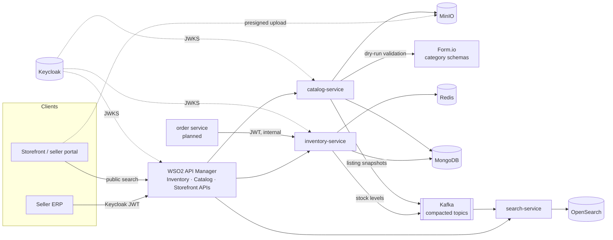

# Souqly

A multi-seller e-commerce marketplace backend, built the way large marketplaces build theirs:
event-driven services, correctness under concurrency, zero-trust security, and tests and load
tests that prove it.

[](https://github.com/asemdreibati/comptech-stack/actions/workflows/ci.yml)

> **Status:** phases 1–3 of 9 are done.
> **Phase 1:** an inventory service that cannot oversell during flash sales.
> **Phase 2:** Keycloak identity, per-object authorization, and a WSO2 API gateway.
> **Phase 3:** a catalog whose category schemas live in Form.io, verified image uploads to MinIO,
> and Arabic/English search on OpenSearch built purely from events.
> Next: orders and payments ([roadmap](docs/roadmap.md)).

## Architecture today



Every service validates every token itself, publishes through a transactional outbox, and shares
one platform library (`libs/platform`) for security, events and transactions.

## Phase 1: a flash sale that cannot oversell

20,000 people try to buy the same 1,000 phones in the same second. The system must sell
**exactly** 1,000, turn the other 19,000 away fast, and survive retries, abandoned carts and crashes.

| `load-tests/flash-sale.js` (20,000 buyers, 1,000 units) | Units sold | Errors | Throughput | p95 |
|---|---|---|---|---|
| First design: per-SKU locking, one commit per order | 1,000 | **7.1%** | ~880 req/s | 2.1 s |
| + group commit | 1,000 | 0 | 2,550–2,750 req/s | 210–230 ms |
| + Redis admission gate | 1,000 | 0 | **3,900–4,500 req/s** | 170–225 ms |
| + Keycloak JWT on every request (phase 2) | 1,000 | 0 | 2,450–3,100 req/s | 230–300 ms |
| + stock-level events for search (phase 3) | 1,000 | 0 | 2,370–3,080 req/s | 240–340 ms |

Measured on a shared 4 vCPU dev box with the load generator on it, so read these as relative
gains, not production capacity. How it works: guarded MongoDB transactions, a Redis Lua gate that
fails open, group commit (flat combining), idempotent order IDs, and a transactional outbox to
Kafka. See [ADR 0001](docs/adr/0001-inventory-reservations.md).

## Phase 2: identity, authorization and the gateway

- **Roles in Keycloak, permissions in services.** Business roles are composites of each service's
  own permissions; the realm is code (`infra/keycloak/souqly-realm.json`).
- **Zero trust.** Every service validates signature, issuer, expiry and audience, even behind
  the gateway.
- **Object-level authorization.** Sellers can only touch their own SKUs and listings. The owner
  check is part of the database write itself (no check-then-act race), and it fails closed.
- **WSO2 API Manager** with Keycloak as its key manager: subscription plans for seller
  integrations, and internal APIs simply not published. Configured as code and tested in CI.

See [ADR 0002](docs/adr/0002-identity-and-api-gateway.md).

## Phase 3: catalog and search

- **Category schemas are Form.io forms** (`infra/formio/forms`), so a new attribute is a form
  change, not a release. Listings are validated by Form.io's own engine (dry run), and fields the
  form does not define are stripped. Testing showed the community edition does not enforce
  dropdown options on the server, so the catalog closes that gap.
- **Facets are declared in the form** (`properties.facet`). Search builds filters for any
  category without knowing its schema.
- **Optimistic concurrency over HTTP:** `ETag` on every listing, `If-Match` required on update
  (`428` without it, `412` when stale).
- **Images go browser → MinIO directly** through presigned URLs that sign the type and size.
  The catalog then checks the file's real size and first bytes before promoting it to the public
  area. A script disguised as a PNG is deleted.
- **Search is a read model built only from compacted Kafka topics.** One document per SKU merges
  listing snapshots and stock levels using version-guarded upserts. Late, duplicate or replayed
  events change nothing, so batches retry safely, poison messages go to a dead-letter topic, and
  the index can be rebuilt from the topics.
- **Arabic and English search:** Arabic normalisation and stemming (`ايفون` finds `آيفون`), typo
  tolerance, autocomplete in both languages, and **disjunctive facets** (choosing 128 GB still
  shows how many 256 GB phones exist).

See [ADR 0003](docs/adr/0003-catalog-and-search.md).

## How it is verified

| Layer | What runs |
|---|---|
| Unit and integration tests | 62 tests on real MongoDB, Redis, Kafka, Keycloak, Form.io, MinIO and OpenSearch in Testcontainers, with no mocks: concurrency races, authorization matrix, tampered tokens, ETag conflicts, disguised uploads, out-of-order events, Arabic matching, dead-lettering |
| Marketplace journey | `infra/e2e/marketplace-smoke.sh`: a seller lists, uploads, publishes and restocks a phone; search finds it in both languages and in stock; the order service sells it out; search shows it sold out |
| Gateway | `infra/wso2/smoke-test.sh`: 15 checks across the Inventory, Catalog and Storefront APIs (auth, subscriptions, ownership, public search, rate limits) |
| Load | Flash-sale test fails the build on a single oversold or undersold unit |
| CI | All of the above on every push, the platform started from scratch |

Operational basics everywhere: RFC 9457 errors with stable codes, Prometheus metrics, ECS JSON
logs, liveness and readiness probes (readiness tracks each service's critical dependency),
layered non-root images, and graceful shutdown.

## Run it

Requirements: Java 21, Docker, `curl` and `jq`. About 6 GB of RAM for the platform, plus 2 GB for
the gateway.

```bash
./mvnw package -DskipTests
docker compose --profile app up -d --build --wait   # all infrastructure + inventory, catalog, search
infra/e2e/marketplace-smoke.sh                      # loads the category forms, then the full journey
```

Add the API gateway:

```bash
docker compose --profile app --profile gateway up -d --wait
infra/wso2/bootstrap.sh && infra/wso2/smoke-test.sh
curl -k 'https://localhost:8243/storefront/v1/search?q=phone&f.storage=256&inStock=true'
```

| What | Where |
|---|---|
| Inventory, catalog, search APIs | http://localhost:8081, :8082, :8083 (each has `/swagger-ui.html`) |
| Gateway | https://localhost:8243/{inventory,catalog,storefront}/v1 · portals at https://localhost:9443/publisher, `/devportal` (admin/admin) |
| Keycloak | http://localhost:8180 (admin/admin) |
| Form.io | http://localhost:3001 (admin@souqly.dev / formio-admin-dev) |
| MinIO console | http://localhost:9001 (souqly / souqly-minio-dev-secret) |
| OpenSearch | http://localhost:9200 |

Development accounts (`souqly-dev-cli` client): `buyer`, `seller-acme`, `seller-globex`, `admin`.
Service accounts: `order-service`, `souqly-ops`, `seller-acme-integration`. All secrets are
development-only.

## Repository layout

```
libs/platform                Shared: Keycloak security baseline, transactional outbox, Mongo transactions
services/inventory-service   Reservations, flash-sale gate, stock ledger
services/catalog-service     Categories (Form.io), listings, verified image uploads (MinIO)
services/search-service      OpenSearch read model, search and autocomplete API
infra/keycloak               Realm: roles, permissions, clients, service accounts
infra/formio                 Category forms and their bootstrap
infra/wso2                   Gateway config, public API definitions, bootstrap and smoke test
infra/e2e                    Cross-service journey test
load-tests/                  k6 scenarios
docs/adr/                    Architecture decision records
```

## Tech

Java 21 (virtual threads) · Spring Boot 4.1 · Spring Security 7 · Keycloak 26 · WSO2 API Manager
4.5 · MongoDB 8 · Redis 7 · Apache Kafka 4 · Form.io · MinIO (S3 API, AWS SDK v2) · OpenSearch 3 ·
Micrometer + Prometheus · Testcontainers · k6 · GitHub Actions.
Camunda and Neo4j join in later phases ([roadmap](docs/roadmap.md)).
