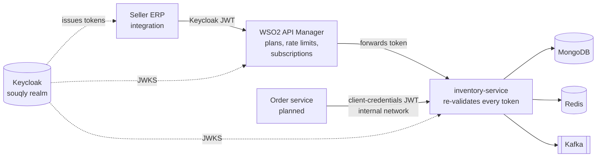

# Souqly

A multi-seller e-commerce marketplace backend, built the way large marketplaces build theirs:
event-driven services, correctness under concurrency, zero-trust security, and load tests that
prove it.

[](https://github.com/asemdreibati/comptech-stack/actions/workflows/ci.yml)

> **Status:** phases 1–2 of 9 are done.
> **Phase 1:** an inventory service that cannot oversell during flash sales.
> **Phase 2:** Keycloak identity, per-object authorization, and a WSO2 API gateway with
> subscription plans for sellers.
> Next: catalog and search, orders and payments, seller workflows, storefront ([roadmap](docs/roadmap.md)).

## Architecture today



## Phase 1: a flash sale that cannot oversell

20,000 people try to buy the same 1,000 phones in the same second. The system must sell
**exactly** 1,000 (never 1,001, never 999), turn the other 19,000 away fast, survive retries,
abandoned carts and crashes, and tell the rest of the platform about every change.

Results from `load-tests/flash-sale.js` (20,000 buyers, 300 concurrent users, 1,000 units):

| | Units sold | Errors | Throughput | p95 latency |
|---|---|---|---|---|
| First design: per-SKU locking, one commit per order | 1,000 | **7.1%** timed out | ~880 req/s | 2.1 s |
| + group commit | 1,000 | 0 | 2,550–2,750 req/s | 210–230 ms |
| + Redis admission gate | 1,000 | 0 | **3,900–4,500 req/s** | 170–225 ms |
| + Keycloak JWT validated on every request (phase 2) | 1,000 | 0 | 2,450–3,100 req/s | 230–300 ms |

Measured on a 4 vCPU dev container with the load generator on the same machine, so read these as
relative gains, not production capacity. CI reruns the test on every push and fails the build if a
single unit is oversold or undersold.

How it works:

1. **MongoDB is the source of truth.** Every unit is taken with a guarded update
   (`available >= qty`) in a transaction that also writes the reservation and its event.
2. **Redis admission gate.** During a sale, an atomic Lua script hands out tokens, and requests
   without one are rejected before reaching MongoDB. If Redis is down, the gate lets everything
   through to MongoDB, which still prevents overselling.
3. **Group commit (flat combining).** Requests for a hot SKU queue up; the thread holding the
   SKU's lock commits the whole queue in **one** transaction, so one disk sync covers up to 200
   orders. This took the service from 7% failures to zero.
4. **Idempotency.** The order ID is a unique key, so a retried request gets the original
   reservation back.
5. **Transactional outbox** to Kafka, and **leaderless expiry** of abandoned reservations.

Details, alternatives and limitations: [ADR 0001](docs/adr/0001-inventory-reservations.md).

## Phase 2: identity, authorization and the API gateway

| Caller | Can do | How it is enforced |
|---|---|---|
| Buyer | nothing on inventory (acts through the order service) | Token is not even addressed to the service (`aud`), so it gets 401 |
| Seller (person or ERP integration) | read stock, restock **only SKUs it owns** | `stock:write` permission + ownership check inside the atomic upsert, so another seller gets 403 |
| Order service | read stock, reserve, confirm, release | `reservation:write`, internal network only (not published on the gateway) |
| Operations | everything, including flash sales and any seller's stock | `flash-sale:manage`, `stock:write-any` |

- **Roles in Keycloak, permissions in services.** Business roles (`seller`, `admin`) are
  composites of each service's own permissions, so changing who can do what is a Keycloak change,
  not a code change. The realm is code: `infra/keycloak/souqly-realm.json`.
- **Zero trust.** The service validates signature, issuer, expiry and audience on every request,
  even behind the gateway. Tests prove that tokens with the wrong audience and tokens with an
  edited payload are rejected.
- **Broken object-level authorization is closed.** A seller cannot restock another seller's SKU
  (the #1 OWASP API risk). The owner check is part of the write itself, so there is no
  check-then-act race, and a seller token without a seller ID fails closed.
- **WSO2 API Manager for external traffic only.** Keycloak is registered as WSO2's key manager.
  Seller integrations are mapped to applications on **Starter** (60/min) or **Business**
  (6,000/min) plans. The gateway enforces subscriptions and quotas, then forwards the original
  token so the service makes its own decisions. Internal APIs are simply not published.
- **Configured as code and tested in CI.** `infra/wso2/bootstrap.sh` sets up WSO2 through its REST
  APIs, and `infra/wso2/smoke-test.sh` checks nine end-to-end behaviours with real tokens on
  every push.

Details, measurements and limitations: [ADR 0002](docs/adr/0002-identity-and-api-gateway.md).

## Production readiness

| Concern | How it is handled |
|---|---|
| Correctness under concurrency | Integration tests race 600 threads for 100 units (gate on and off), multi-SKU orders in both line orders, and 200 simultaneous retries of one order |
| Real infrastructure in tests | Testcontainers runs MongoDB (replica set), Redis, Kafka and Keycloak, with no mocks |
| Security | OAuth2 resource server, audience-restricted tokens, per-object authorization, 17-case authorization matrix, real-token end-to-end tests, gateway smoke test in CI |
| API errors | RFC 9457 problem details with stable `code` fields, including 401/403 (`NOT_SKU_OWNER`, `INSUFFICIENT_STOCK`, ...) |
| Overload | Bounded lock waits shed load with `503` + `Retry-After`; gateway quotas per subscription |
| Observability | Prometheus metrics (batch sizes, lock waits, gate failures, transaction retries, outbox publishes, token-cache hit rate), ECS JSON logs, liveness and readiness probes |
| Degradation | Redis is excluded from readiness; Keycloak keys are fetched lazily, so a brief outage does not stop the service |
| Packaging | Layered, non-root Docker image with a health check |
| CI | Build and integration tests, flash-sale load test, gateway end-to-end test |

## Run it

Requirements: Java 21, Docker, and `curl` + `jq` for the gateway scripts.

```bash
./mvnw -pl services/inventory-service -am package -DskipTests
docker compose --profile app up -d --build --wait     # Keycloak, MongoDB, Redis, Kafka, inventory-service
```

Get a token and call the service directly (the internal path):

```bash
TOKEN=$(curl -s localhost:8180/realms/souqly/protocol/openid-connect/token -d grant_type=client_credentials \
  -d client_id=souqly-ops -d client_secret=souqly-ops-dev-secret | jq -r .access_token)

curl -X POST localhost:8081/api/v1/stock/PHONE-128GB/restock -H "Authorization: Bearer $TOKEN" \
     -H 'Content-Type: application/json' -d '{"quantity": 100}'
curl -X POST localhost:8081/api/v1/reservations -H "Authorization: Bearer $TOKEN" \
     -H 'Content-Type: application/json' -d '{"orderId": "order-1001", "lines": [{"sku": "PHONE-128GB", "quantity": 2}]}'
```

Add the API gateway (about 2 GB RAM and 2 minutes to start), configure it, and verify it:

```bash
docker compose --profile app --profile gateway up -d --wait
infra/wso2/bootstrap.sh       # prints a ready-to-run gateway call for the ACME seller integration
infra/wso2/smoke-test.sh
```

Useful URLs: API docs http://localhost:8081/swagger-ui.html · Keycloak http://localhost:8180
(admin/admin) · WSO2 publisher and developer portal https://localhost:9443/publisher and
`/devportal` (admin/admin).

Development accounts (realm file): `buyer`, `seller-acme`, `seller-globex`, `admin` through the
`souqly-dev-cli` client, plus service accounts `order-service`, `souqly-ops` and
`seller-acme-integration`. All secrets are development-only.

Tests: `./mvnw verify` (needs Docker). Load test:
`docker run --rm -i --network host grafana/k6 run - < load-tests/flash-sale.js`.

## Repository layout

```
services/inventory-service   Spring Boot 4 service: reservations, flash-sale gate, outbox, security
infra/keycloak/              Souqly realm (roles, clients, service accounts, user profile)
infra/wso2/                  API Manager config, public API definition, bootstrap and smoke test
load-tests/                  k6 scenarios
docs/adr/                    Architecture decision records
docs/roadmap.md              The remaining phases and the stack each one uses
docker-compose.yml           Local platform
```

## Tech

Java 21 (virtual threads) · Spring Boot 4.1 · Spring Security 7 (OAuth2 resource server) ·
Keycloak 26 · WSO2 API Manager 4.5 · MongoDB 8 · Redis 7 · Apache Kafka 4 · Micrometer +
Prometheus · Testcontainers · k6 · GitHub Actions.
OpenSearch, MinIO, Form.io, Camunda and Neo4j join in later phases ([roadmap](docs/roadmap.md)).
