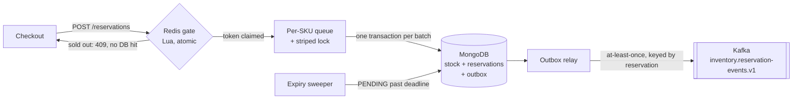

# Souqly

A multi-seller e-commerce marketplace backend, built the way large marketplaces build theirs:
event-driven services, correctness under concurrency, and load tests that prove it.

[](https://github.com/asemdreibati/comptech-stack/actions/workflows/ci.yml)

> **Status:** phase 1 of 9 is done: the inventory service, the hardest correctness problem in
> e-commerce. See the [roadmap](docs/roadmap.md) for catalog, search, orders, payments, seller
> workflows and the storefront.

## The problem phase 1 solves

During a flash sale, 20,000 people try to buy the same 1,000 phones in the same second. The
system must:

- sell **exactly** 1,000: never 1,001 (an oversell costs money and a customer), never 999;
- answer the other 19,000 quickly with "sold out" rather than timing out;
- survive client retries, abandoned carts and crashes without losing or double-counting a unit;
- tell the rest of the platform (search, orders, analytics) about every change, reliably.

## Results

20,000 buyers and 300 concurrent users race for 1,000 units of one SKU (`load-tests/flash-sale.js`):

| | Units sold | Errors | Throughput | p95 latency |
|---|---|---|---|---|
| First design: per-SKU locking, one commit per order | 1,000 | **7.1%** timed out | ~880 req/s | 2.1 s |
| + group commit | 1,000 | 0 | 2,550–2,750 req/s | 210–230 ms |
| + group commit + Redis admission gate | 1,000 | 0 | **3,900–4,500 req/s** | 170–225 ms |

Measured on a 4 vCPU dev container with the load generator on the same machine. CI repeats the
test on every push and fails the build if a single unit is oversold or undersold.

## How it works



1. **MongoDB is the source of truth.** Every unit is taken with a guarded update
   (`available >= qty`) in a transaction that also writes the reservation and its event. Nothing
   above this layer can cause an oversell.
2. **Redis admission gate.** During a flash sale, an atomic Lua script hands out a limited
   number of tokens, and requests without one are rejected before reaching MongoDB. If Redis is
   down, the gate lets everything through to MongoDB, which still prevents overselling.
3. **Group commit (flat combining).** Requests for a hot SKU queue up per instance; the thread
   holding the SKU's lock commits the whole queue in **one** transaction, so one disk sync covers
   up to 200 orders. This is the change that took the service from 7% failures to zero.
4. **Idempotency.** The order ID is a unique key: retrying a request returns the original
   reservation, and reusing an ID with different contents is rejected.
5. **Transactional outbox.** Events are committed together with the state change, then relayed to
   Kafka using leases, so multiple instances can run the relay without sending the same event at
   the same time.
6. **Self-healing.** Abandoned reservations expire automatically, on every instance at once,
   with no leader election, and their stock and gate tokens go back on sale.

The reasoning, the alternatives and the known limitations are in
**[ADR 0001: inventory reservations that cannot oversell](docs/adr/0001-inventory-reservations.md)**.

## Production readiness

| Concern | How it is handled |
|---|---|
| Correctness under concurrency | Integration tests race 600 threads for 100 units (gate on and off), multi-SKU orders whose lines arrive in both orders, and 200 simultaneous retries of one order |
| Real infrastructure in tests | Testcontainers runs MongoDB (replica set), Redis and Kafka, with no mocks |
| API errors | RFC 9457 problem details with stable `code` fields (`INSUFFICIENT_STOCK`, `RESERVATION_EXPIRED`, ...) |
| Overload | Bounded lock waits shed load with `503` + `Retry-After` instead of queueing forever |
| Observability | Prometheus metrics (batch sizes, lock wait times, gate failures, transaction retries, outbox publishes and failures), ECS JSON logs, liveness and readiness probes |
| Degradation | Redis is excluded from readiness: losing it slows the service down but never takes it out of rotation |
| Packaging | Layered, non-root Docker image with a health check and container-aware memory settings |
| CI | Build, integration tests and a flash-sale load test on every push |

## Run it

Requirements: Java 21 and Docker.

```bash
./mvnw -pl services/inventory-service -am package -DskipTests
docker compose --profile app up -d --build --wait     # MongoDB, Redis, Kafka, inventory-service
```

API docs: http://localhost:8081/swagger-ui.html · Metrics: http://localhost:8081/actuator/prometheus

```bash
# Stock 100 phones and put 50 of them on flash sale
curl -X POST localhost:8081/api/v1/stock/PHONE-128GB/restock -H 'Content-Type: application/json' -d '{"quantity": 100}'
curl -X PUT  localhost:8081/api/v1/flash-sales/PHONE-128GB   -H 'Content-Type: application/json' -d '{"tokens": 50}'

# Reserve for an order (retrying with the same orderId returns the same reservation)
curl -X POST localhost:8081/api/v1/reservations -H 'Content-Type: application/json' \
     -d '{"orderId": "order-1001", "lines": [{"sku": "PHONE-128GB", "quantity": 2}]}'

# Then confirm on payment, or release on cancellation
curl -X POST localhost:8081/api/v1/reservations/{id}/confirm
curl -X POST localhost:8081/api/v1/reservations/{id}/release
```

Load test:

```bash
docker run --rm -i --network host grafana/k6 run - < load-tests/flash-sale.js              # gate armed
docker run --rm -i --network host -e GATE=false grafana/k6 run - < load-tests/flash-sale.js # MongoDB only
```

Tests: `./mvnw verify` (needs Docker). To run the service from your IDE with throwaway containers,
start `TestInventoryApplication` from the test sources.

## Repository layout

```
services/inventory-service   Spring Boot 4 service: reservations, flash-sale gate, outbox
load-tests/                  k6 scenarios
docs/adr/                    Architecture decision records
docs/roadmap.md              The remaining phases and the stack each one uses
docker-compose.yml           Local platform
```

## Tech

Java 21 (virtual threads) · Spring Boot 4.1 · MongoDB 8 (multi-document transactions) · Redis 7
(Lua) · Apache Kafka 4 (KRaft) · Micrometer + Prometheus · Testcontainers · k6 · GitHub Actions.
Keycloak, WSO2 API Manager, OpenSearch, MinIO, Form.io, Camunda and Neo4j join in later phases
([roadmap](docs/roadmap.md)).
