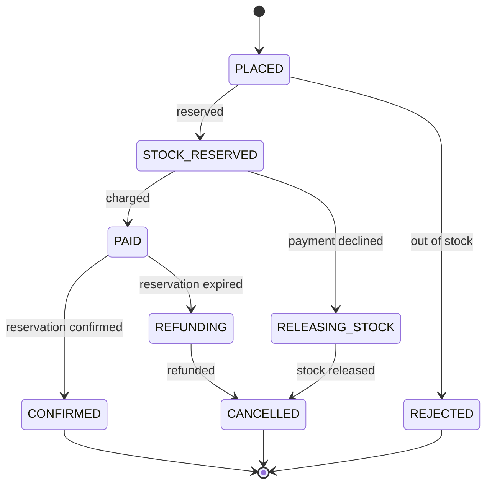

# ADR 0004: Checkout as an orchestrated saga with idempotent steps

- Status: Accepted
- Date: 2026-10-02
- Services: new `order-service`; changes to `inventory-service`

## Context

A checkout touches three systems that share no database: the order service (the order),
inventory (the stock) and a payment service provider (the money). There is no distributed
transaction across them. A PSP will not join an XA transaction, and two-phase locking across
services would make every checkout as slow and as available as the worst of them.

Every call can fail in three ways: it succeeds, it is refused, or **nobody knows**. A timeout on
a charge does not mean the card was not charged. A checkout that loses track of money or stock
costs real customers real money, so "nobody knows" has to be designed for, not logged.

## Decisions

### 1. An orchestrated saga, one step at a time

The order service drives checkout as a state machine stored on the order:

Each status names exactly one remote step still to do. `CheckoutSaga` performs that step,
records the result, and moves on. The whole flow, compensations included, reads top to bottom
in one class.

**Stock is reserved before payment.** Charging first and then finding no stock would mean a
refund on every sold-out race, and in a flash sale that is most orders. A reservation holds
stock for 10 minutes (ADR 0001), long enough to pay. If payment fails the reservation is
released; if payment succeeds but the reservation expired in the meantime, the payment is
refunded.

### 2. Every hop is idempotent

| Caller → callee | Idempotency key | A repeat returns |
|---|---|---|
| Buyer → order service | `Idempotency-Key` header, unique per buyer, bound to a SHA-256 fingerprint of the request | the same order (`200`, `Idempotent-Replayed: true`); a different basket under the same key gets `422 IDEMPOTENCY_KEY_REUSED` |
| Order service → inventory | the order ID (reservations are keyed by it) | the original reservation; confirm and release are no-ops when repeated |
| Order service → PSP | `order-<id>` for the charge, `refund-order-<id>` for the refund | the PSP's original result, never a second charge |

The buyer key has a unique index (buyer, key), so two identical requests that arrive at the same
moment still create one order. Because every step can safely be repeated, the saga's recovery
is always the same move: do the current step again.

### 3. Unknown is not failed

A timeout, connection error, `409` (request in flight), `429` or `5xx` from inventory or the PSP
is recorded as a failed **attempt**, not as a decision. The step is retried with jittered
exponential backoff (1 s doubling to 1 min) with the same idempotency key, until it gives a
definite answer. Only definite refusals (`402`, a declined card, `409 INSUFFICIENT_STOCK`,
`409 RESERVATION_EXPIRED`) move the order forward. After 30 attempts the order goes to
`NEEDS_ATTENTION` instead of guessing; money or stock may be in limbo, and a person decides.

### 4. Durable progress, one owner at a time

- Every transition is a **version-guarded update** written in the same MongoDB transaction as
  its `Order…` event (transactional outbox). The stored status always says what is done.
- An instance advancing an order holds a **lease** on it (30 s). A **recovery sweeper** on every
  instance continues orders whose next attempt is due and whose lease has expired, so a crash
  between "charged" and "recorded" is finished by another instance from the persisted status.
  Repeating the charge there is safe because of the PSP key.
- Checkout runs **inside the buyer's request** so the answer is usually final: `201` with the
  order `CONFIRMED`, `REJECTED` or `CANCELLED`. If a step must be retried, the answer is `202`
  with a `Location` to poll, and the sweeper completes it in the background. A new order is
  left to its request for 5 seconds before the sweeper may take over.

### 5. Prices come from a local price book

The order service keeps a replica of listing prices built from the catalog's compacted topic,
with the same version-guarded upsert as search (ADR 0003). Checkout does not call the catalog,
so it keeps working when the catalog is down, and the unit price, title and seller are copied
onto the order line. Only `ACTIVE` listings priced in a real currency, with no more decimals
than that currency has, can be bought. One order is paid in one currency. Amounts go to the PSP
in that currency's minor units (AED has 2 decimals, KWD has 3).

### 6. Identities

- Buyers hold `order-service` client roles (`order:place`; operations staff also get
  `order:read-any`), so Keycloak addresses buyer tokens to the order service and to nothing
  else. A seller's token is rejected (`401`) by its audience before any role check.
- Buyers see only their own orders; someone else's order answers `404`, not `403`, so order
  IDs cannot be probed.
- The order service calls inventory with **its own client-credentials token**, not the buyer's.
  Spring Security's OAuth2 client fetches and caches it, also on the sweeper's threads where
  there is no request.
- Card details never reach Souqly. The buyer's browser exchanges them with the PSP for a
  payment-method token; the order keeps that token only until payment is attempted.

### 7. Inventory takes SKU ownership from the catalog

ADR 0003 left two owners for a SKU: the catalog's listing and inventory's first restock.
Inventory now consumes `catalog.products.v1` and creates the stock record with the listing's
seller (`$setOnInsert`, zero stock) as soon as a listing exists. The listing decides who owns
the SKU, and the first-restock rule only applies to stock with no listing. If a stock record
already belongs to another seller, nothing changes. A warning is logged and
`souqly.inventory.ownership.conflicts` is incremented.

## Verification

- **16 integration tests** on real MongoDB and Kafka. WireMock plays Keycloak's token
  endpoint, inventory and a Stripe-style PSP, so tests can script slow, failing and refusing
  answers:
  - happy path, with the token, keys and minor units each service received;
  - out of stock, without charging;
  - a declined card releases the stock;
  - **a PSP timeout is retried with the same key**, and the order confirms (`202`, then
    `CONFIRMED`);
  - a reservation that expired before confirmation is refunded;
  - an inventory outage delays the order instead of failing it;
  - a step that never recovers ends in `NEEDS_ATTENTION` after the configured attempts;
  - **an order abandoned mid-checkout** (paid, lease expired) is finished by recovery without
    charging again, while an order leased by a live instance is left alone;
  - idempotent checkout and key reuse, ownership, permissions, unavailable products, mixed
    currencies, request validation;
  - the price book following, and ignoring stale, catalog events.
- **Marketplace journey** (`infra/e2e/marketplace-smoke.sh`) against the whole platform and a
  WireMock PSP (`infra/psp`). A buyer with a Keycloak token goes through the flows above:
  - a declined card cancels the order and the stock returns;
  - an order is confirmed at the catalog price, and a retried request returns the same order;
  - an order larger than the remaining stock is rejected;
  - the last units sell, and search shows the product sold out.
- **Order events** (`orders.order-events.v1`) carry one snapshot per step, keyed by order.
- **Indicative latency:** 100 sequential checkouts on the 4 vCPU dev box with the whole
  platform running gave p50 116 ms and p95 201 ms. Each checkout is three remote calls and four
  MongoDB transactions.

## Alternatives considered

- **Choreography** (each service reacts to the previous one's event). No central coordinator,
  but the flow and its compensations would be spread over three services' listeners. The
  orchestrator keeps it in one class with one state field.
- **Pay first, then reserve.** Simpler for one item, but every sold-out race becomes a refund,
  and refunds cost fees and trust.
- **Camunda as the saga engine.** It would give a visual model and an operations UI for stuck
  orders. Checkout is three machine-speed steps that must answer within the buyer's request,
  so the state machine lives in code. Camunda arrives in phase 5 for the long-running,
  human-in-the-loop workflows it suits (seller onboarding, returns, disputes).
- **Treating a PSP timeout as a decline.** Simple, and it double-charges buyers who retry.

## Consequences and known limitations

- **JSON events, not Avro.** The roadmap planned Avro with Confluent Schema Registry for this
  phase. Confluent's Maven repository (`packages.confluent.io`) is not reachable from the
  build environment, so the serializer cannot be added. Events stay versioned JSON records
  (`.v1` topics, additive changes only). Moving to Avro is a serializer and Compose change once
  that repository is available.
- **Charge, not authorize-then-capture.** Real marketplaces authorize at checkout and capture at
  shipment. That needs a fulfilment service, which comes later.
- **One shipment per order.** Orders with several sellers are not yet split into per-seller
  fulfilments.
- **`NEEDS_ATTENTION` has no back-office screen yet.** It is visible through metrics
  (`souqly.order.completed{status}`), logs and the order events.
- **Checkout is not yet on the API gateway.** It is a buyer-facing API for the storefront
  (phase 7).
- **The fake PSP** only answers success and decline; slow and failing PSP behaviour is covered by
  the integration tests.
- **The sweeper advances due orders one after another** on each instance (up to 50 per pass).
  That is enough for retries. For a large backlog, the next step is to advance them in parallel
  on virtual threads.
