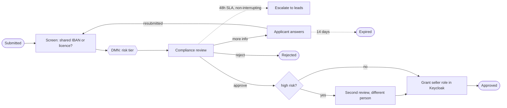
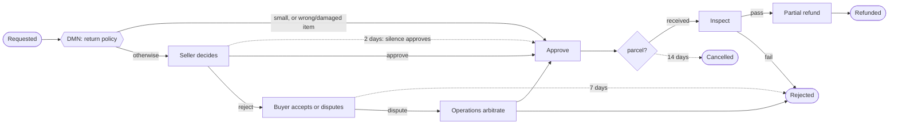

# ADR 0005: Seller onboarding and returns as BPMN workflows on CIB seven

- Status: Accepted
- Date: 2026-10-04
- Services: new `seller-service` and `returns-service`; changes to `libs/platform`, `order-service`
  and the Keycloak realm

## Context

Two processes are long-running and involve people:

- **Seller onboarding (KYC).** Applicants submit business details and documents. Compliance
  reviews them within an SLA, may ask for more, and high-risk sellers need a second reviewer.
  Approval must turn the applicant into a seller everywhere at once.
- **Returns.** A return can take weeks. A policy decides first, then the seller within a deadline.
  Buyers can dispute a rejection, operations arbitrate, the parcel may never arrive, and the
  warehouse inspects before anyone is refunded.

These processes are mostly waiting: for people, for deadlines, for parcels. The waits, timers and
escalations are the hard part, and compliance wants to see the process itself, not only code that
implements it. The mandated stack includes Camunda BPM.

## Decisions

### 1. CIB seven: Camunda 7's engine, Apache-licensed, embedded

The roadmap left Camunda 7 or 8 open. The deciding facts, checked against Maven Central and Docker
Hub:

| | Camunda 8.10 | Camunda 7.24 CE | CIB seven 2.2 | Operaton 2.2 |
|---|---|---|---|---|
| Licence for production | Commercial licence required | Apache 2.0 | Apache 2.0 | Apache 2.0 |
| Maintained | Yes | Community edition ended October 2025 | Yes | Yes |
| Spring Boot 4 | Yes | No (3.5) | Yes, stable starter | Release candidate only |
| Runs as | Separate cluster (Zeebe), job workers | Embedded library | Embedded library | Embedded library |

There is no licence budget, so Camunda 8 is out for production. CIB seven is a maintained fork of
Camunda 7 by a long-standing Camunda partner. It keeps the "Camunda BPM" API (BPMN, DMN,
`camunda:` extensions, Java delegates, job executor, Cockpit-style operations) and has a stable
Spring Boot 4 starter. A spike first proved it on this project's exact stack (Spring Boot 4.1,
Java 21, PostgreSQL 17).

The engine is **embedded** in each service, with **its own PostgreSQL database**. An API call that
changes an application and the process state it drives commit in **one transaction**. For
example, submitting an application inserts its status change and starts its process together, so
neither can exist without the other.

### 2. Each status change is a job, and the job table is the outbox

Every step that changes a status is an **asynchronous service task**. It updates the row,
publishes the event, and only then lets the job commit. If Kafka is unavailable, the send fails,
the whole job rolls back (status change included), and the engine retries it. So no status change
happens without its event, which is the guarantee a transactional outbox gives (ADR 0001), without
a second outbox table and relay. As with any outbox, delivery is at least once: events are
snapshots carrying `version`.

The same mechanism handles failing integrations. Granting a role in Keycloak or a refund at the PSP
runs in its own job and is idempotent. After its retries are exhausted, it becomes an engine
**incident**, visible to operations and retryable once the cause is fixed (both are covered by
tests). A process never guesses.

### 3. Seller onboarding (`seller-onboarding.bpmn`, `kyc-risk.dmn`)

- **KYC details are a Form.io form** (`infra/formio/forms/seller-kyc.json`), validated by Form.io's
  engine through the platform validator (moved from the catalog into `libs/platform`, ADR 0003).
- **Documents** (trade licence, ID, bank letter) are uploaded straight to a **private** bucket and
  verified by their first bytes. Reviewers read them through 5-minute signed links.
- **Screening** flags other people's submitted applications that share the bank account or trade
  licence: one business behind several accounts, or a stolen identity.
- **Risk** is a DMN table: shared identifiers or very high volume give HIGH; an individual trader
  with company-sized volume, or registration outside the UAE and Saudi Arabia, gives MEDIUM.
  Compliance can change the rules without a code change.
- **SLA escalation is non-interrupting**: the task gets priority 80 and is opened to compliance
  leads, but the officer working on it keeps it.
- **Four eyes:** HIGH-risk approvals need a second reviewer from compliance leads. The API refuses
  the first reviewer (`409 FOUR_EYES_REQUIRED`).
- **Approval grants the identity:** the service's own Keycloak account (`view-users`,
  `manage-users`, `view-realm` only) sets `seller_id` and adds the `seller` role. The applicant's
  next sign-in carries the catalog and inventory permissions of a seller, with no manual step.
  Seller IDs already held by any Keycloak user are refused at application time and checked again
  at provisioning.
- **Privacy:** events carry bank account, phone and licence only as **keyed HMAC-SHA256 hashes**.
  Phase 6 can link sellers who share a bank account without anyone reading it.
- **Audit:** every decision is stored with who made it. Applicants see the decisions and reasons,
  but not who made them.

### 4. Returns (`return-request.bpmn`, `return-policy.dmn`)

- **Orders come from events.** The service keeps a replica built from `orders.order-events.v1`
  (now carrying the payment ID) with version-guarded upserts. It checks ownership, confirmation, the
  14-day window and quantities without calling the order service.
- **No over-returning.** Quantities in open or completed returns are subtracted. Concurrent requests
  for the same order are serialised by a **row lock on the order**: six parallel requests for the
  same two units create exactly one return (tested).
- **One return per seller**, since each seller decides on their own. Sellers only see their own
  queue (candidate group `seller-<sellerId>`), and only the buyer can answer for their return.
- **Silence approves:** a seller who does not answer within 2 days has the return approved, and the
  audit trail records it as the system's decision.
- **Waiting for the parcel** is an **event-based gateway**: the warehouse's scan correlates a
  `ParcelReceived` message, racing a 14-day timer that cancels the return.
- **Refunds are partial and idempotent**: the PSP client moved to `libs/platform`, gained partial
  refunds in minor units, and uses the key `return-<id>`. A PSP outage becomes an incident;
  retrying the job after recovery refunds once (tested).

### 5. Identities

| Realm role | Seller service | Returns service |
|---|---|---|
| buyer | `application:submit` | `return:request` |
| seller | | `return:decide` (own products only) |
| compliance (new) | `application:review` | |
| warehouse (new) | | `return:handle` |
| admin | `application:review`, `application:review-senior` | `return:arbitrate`, `return:handle` |

Workflow candidate groups are derived from these permissions in each service. Keycloak stays the
only source of who may do what.

## Verification

- **22 integration tests** on real PostgreSQL, Kafka, Form.io, MinIO and Keycloak (seller), or
  PostgreSQL, Kafka and a WireMock PSP (returns). Timers are fired by executing their jobs:
  - onboarding:
    - approval through to a real Keycloak token with `seller_id` and seller permissions;
    - the request-for-information loop and its expiry;
    - four eyes;
    - SLA escalation;
    - a provisioning failure that becomes an incident instead of an approval;
    - form validation, seller ID takeover attempts, disguised documents, privacy of applications;
  - returns:
    - policy approval through inspection to a partial refund;
    - seller decisions and their deadline;
    - dispute and arbitration, and an unanswered dispute window;
    - a parcel that never arrives, and a failed inspection;
    - a refund incident and its recovery;
    - over-return rules, the concurrent-request race, idempotent requests, and who may act when.
- **Marketplace journey:** a brand-new Keycloak user applies, uploads documents to MinIO, is
  approved by the compliance user, signs in again as a seller and lists the phone the rest of the
  journey sells. After checkout, the buyer returns one unit, the new seller approves, the warehouse
  user receives and inspects it, and the refund goes through the PSP.
- The `.bpmn` files carry diagram layout, so they open as diagrams in Camunda Modeler.

## Alternatives considered

- **Camunda 8.** The modern product: horizontally scalable, with Operate and Tasklist. It needs a
  licence in production and runs as a separate cluster, which is a lot of infrastructure for two
  processes. The BPMN and DMN here would mostly carry over if a licence appears.
- **A hand-written state machine, as in the checkout saga (ADR 0004).** It suits checkout's three
  machine-speed steps answered within a request. These processes run for days, with people,
  deadlines and escalations, and compliance wants to read and change them as models.
- **One shared workflow service for every process.** It would centralise the engine but couple
  unrelated domains, their deployments and their databases. Each service embedding its own engine
  keeps ownership with the domain.
- **A separate outbox table for workflow services.** The job executor already gives the same
  guarantee (decision 2).

## Consequences and known limitations

- **No operations UI is bundled yet.** Incidents, timers and history are in the engine's tables
  and API; the tests use them. CIB seven's web apps would need their own authentication setup
  against Keycloak.
- **Engine tables are created on first start** (`schema-update: true`). Production should apply
  the engine's SQL scripts through Flyway, alongside the services' own migrations.
- **Returned items are not restocked automatically.** Inventory restocks are not idempotent per
  return yet; returned goods are a warehouse decision.
- **Documents are kept indefinitely.** Production needs a retention policy (lifecycle rules on
  `documents/`) agreed with compliance.
- **Thresholds and deadlines** (risk rules, 48-hour SLA, 2-day seller deadline, 14-day windows) are
  examples, set in DMN tables and configuration.
